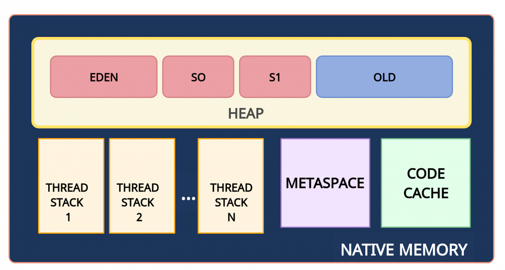

## Организация памяти в JVM, куча и стек, сборка мусора

- [Введение](#Введение)
- [Структура памяти Java](#Структура-памяти-Java)
- [Как устроена куча и поколения объектов в ней](#Как-устроена-куча-и-поколения-объектов-в-ней)
- [Что такое автоматическая сборка мусора](#Что-такое-автоматическая-сборка-мусора)
- [Как происходит освобождение памяти](#Как-происходит-освобождение-памяти)
- [Алгоритм сборки мусора](#Алгоритм-сборки-мусора)
- [Типы сборки мусора](#Типы-сборки-мусора)

## Введение
JVM (Java Virtual Machine или виртуальная машина Java) — основная часть исполняющей системы Java, так называемой Java Runtime Environment (JRE). Виртуальная машина Java исполняет байт-код Java, предварительно созданный из исходного текста Java-программы компилятором Java (javac). JVM может также использоваться для выполнения программ, написанных на других языках программирования.

JVM является ключевым компонентом платформы Java. Так как виртуальные машины Java доступны для многих аппаратных и программных платформ, Java может рассматриваться и как связующее программное обеспечение, и как самостоятельная платформа. Использование одного байт-кода для многих платформ позволяет описать Java как «скомпилируй единожды, запускай везде» (compile once, run anywhere).
Виртуальные машины Java обычно содержат интерпретатор байт-кода, однако, для повышения производительности во многих машинах также применяется JIT-компиляция часто исполняемых фрагментов байт-кода в машинный код.
JIT-компиляция (англ. Just-in-Time, компиляция «точно в нужное время»), динамическая компиляция (англ. dynamic translation) — технология увеличения производительности программных систем, использующих байт-код, путём компиляции байт-кода в машинный код или в другой формат непосредственно во время работы программы. Таким образом достигается высокая скорость выполнения по сравнению с интерпретируемым байт-кодом[1] (сравнимая с компилируемыми языками) за счёт увеличения потребления памяти (для хранения результатов компиляции) и затрат времени на компиляцию.
Т.е. обычный код компилируется в байт-код заранее (Ahead-of-Time), а вот байт-код в машинный JVM-ом динамически в кэш прямо во время выполнения программы.

**Три части JVM**

Глобально JVM состоит из трех частей: спецификация, реализация и экземпляр. Рассмотрим каждую из них.
1. Спецификация JVM
   Первая часть JVM — спецификация в которой не определены детали реализации JVM, что обеспечивает максимальную свободу творчества при ее создании.
2. Реализация JVM
   Существует множество различных реализаций спецификации JVM как коммерческих, так и с открытым исходным кодом. JVM HotSpot от проекта OpenJDK является эталонной реализацией и содержит одну из наиболее тщательно проверенных в мире кодовых баз. HotSpot также является самой широко используемой JVM.
   Почти все лицензированные JVM созданы, как ответвление от OpenJDK и HotSpot JVM, включая лицензионный JDK от Oracle.
3. Экземпляр JVM
   После того как спецификация JVM реализована и выпущена, вы можете загрузить ее как приложение. Загруженная программа является экземпляром виртуальной машины.

## Структура памяти Java
Память в Java выглядит следующим образом:

Native Memory — вся доступная системная память. 

Heap (куча) — часть native memory, выделенная для кучи. Здесь JVM хранит объекты. Это общее пространство для всех потоков приложения. Размер этой области памяти настраивается с помощью параметра -Xms (минимальный размер) и -Xmx (максимальный размер).

Stack (стек) — используется для хранения локальных переменных (в т.ч. и переменных-ссылок на объекты) и стека вызовов метода. Для каждого потока выделяется свой стек.

Metaspace (метаданные) — в этой памяти хранятся метаданные классов и статические переменные. Это пространство также является общими для всех. Так как metaspace является частью native memory, то его размер зависит от платформы. Верхний предел объема памяти, используемой для metaspace, можно настроить с помощью флага MaxMetaspaceSize.

PermGen (Permanent Generation, постоянное поколение) присутствовало до Java 7. Начиная с Java 8 ему на смену пришла область Metaspace.

CodeCache (кэш кода) — JIT-компилятор компилирует часто исполняемый код, преобразует его в нативный машинный код и кэширует для более быстрого выполнения. Это тоже часть native memory.

## Как устроена куча и поколения объектов в ней
Что такое поколения объектов?
Для оптимизации сборки мусора память кучи дополнительно разделена на четыре области. В эти области объекты помещаются в зависимости от их возраста (как долго они используются в приложении).
1. Young Generation (молодое поколение). Здесь создаются новые объекты. Область young generation разделена на три части раздела: Eden (Эдем), S0 и S1 (Survivor Space — область для выживших).
2. Old Generation (старое поколение). Здесь хранятся давно живущие объекты.

**Young Generation**

Вновь созданные объекты начинаются в Young Generation. Его еще называют ясли, так как здесь начинают жить новые объекты. Young Generation подразделяется на Eden Space, где начинаются все новые объекты, и два пространства Survivor , где объекты перемещаются из Eden после сохранения (surviving) в одном цикле сборки мусора. Они вызывают повторную сборку мусора, когда объекты собираются сборщиком мусора из Young Generation.

**Eden Space**

Все новые объекты сначала создаются в Eden Space. Незначительный сбор мусора сработает, когда он достигнет порога, определяемого JVM. Упомянутые объекты перемещаются из Eden Space в пространство первого сохранения (‘Eden’ and ‘from’ —> ‘to’). Объекты, на которые нет ссылок, удаляются при очистке Eden Space. Survivor 0 (S0) and Survivor 1 (S1) Оба поля survivor (From and to) начинаются пустыми. Когда происходит повторная сборка мусора, все объекты, на которые есть ссылки, перемещаются в оставшееся пространство. Когда сборка мусора закончится, места (имена) survivor «from» и «to» меняются местами. Если во время предыдущей сборки мусора S1 был в роли «to», то теперь S1 заполнен и становится «from». Соответственно, если S0 пусто, то оно станет «to».

**Old Generation**

После незначительной сборки мусора, когда устаревшие объекты достигают определенного порога возраста (по умолчанию порог современных JVM установлен на 15 циклов сборки мусора), они вместе с объектами-долгожителями переходят из молодого поколения в старое. Поскольку второстепенные сборщики мусора продолжают возникать, объекты продолжают перемещаться в пространство Old Generation, оно начнет заполняться и произойдет основной сбор мусора. Основная сборка мусора происходит, когда объекты собираются сборщиком мусора Old Generation.

## Что такое автоматическая сборка мусора
Что такое "мусор"? Мусором считается объект, который больше не может быть достигнут по ссылке из какого-либо объекта. Поскольку такие объекты больше не используются в приложении, то их можно удалить из памяти.

Автоматическая сборка мусора - процесс идентификации объектов, находящихся в куче, а также удаления более неиспользуемых объектов. Объекты, находящиеся в использовании (т.е. те, на которые есть ссылка) обозначают те части программы, которые все еще имеют указатель на этот объект. Неиспользуемый объект (или не имеющий ссылок, “мусор”), соответственно не имеют ссылок на них из какой-либо части программы. Т.е. память, занятая таким объектом, может быть освобождена.

В таких языках программирования, как С, выделение и освобождение памяти выполняется вручную (программистом). В Java данные процессы выполняются автоматически т.н. “Сборщиком мусора”.

В следующем примере объект fruit2 может быть удален:

## Как происходит освобождение памяти
Для сборки мусора используется алгоритм пометок (Mark & Sweep). Этот алгоритм состоит из трех этапов:
- Маркировка. (Mark)
- Обычное удаление. (Sweep)
- Удаление с уплотнением. (Compact)

Маркировка — это процесс идентификации частей памяти, которые используются и не используются сборщиком мусора. Обычно маркировка является первым этапом.

Обычное удаление — процесс удаления объектов, на которые нет ссылок, с оставлением в свободном пространстве объектов и указателей, на которые есть ссылки.

Удаление с уплотнением — помимо удаления объектов, на которые нет ссылок, оно сжимает оставшиеся объекты, на которые имеются ссылки, перемещая объекты вместе, чтобы сделать новое выделение памяти намного проще и быстрее.

## Алгоритм сборки мусора
Что такое Stop the World?

Когда запускается этап mark, работа приложения останавливается. После завершения mark приложение возобновляет свою работу. Любая сборка мусора — это "Stop the World".

Что такое гипотеза о поколениях?

Как уже упоминалось ранее, для оптимизации этапов mark и sweep используются поколения. Гипотеза о поколениях говорит о следующем:
- Большинство объектов живут недолго.
- Если объект выживает, то он, скорее всего, будет жить вечно.
- Этапы mark и sweep занимают меньше времени при большом количестве мусора. То есть маркировка будет происходить быстрее, если анализируемая область небольшая и в ней много мертвых объектов.

Таким образом, алгоритм сборки мусора, использующий поколения, выглядит следующим образом:

1. Новые объекты создаются в области Eden. Области Survivor (S0, S1) на данный момент пустые.
2. Когда область Eden заполняется, происходит минорная сборка мусора (Minor GC). Minor GC — это процесс, при котором операции mark и sweep выполняются для young generation (молодого поколения).
3. После Minor GC живые объекты перемещаются в одну из областей Survivor (например, S0). Мертвые объекты полностью удаляются.
4. По мере работы приложения пространство Eden заполняется новыми объектами. При очередном Minor GC области young generation и S0 очищаются. На этот раз выжившие объекты перемещаются в область S1, и их возраст увеличивается (отметка о том, что они пережили сборку мусора).
5. При следующем Minor GC процесс повторяется. Однако на этот раз области Survivor меняются местами. Живые объекты перемещаются в S0 и у них увеличивается возраст. Области Eden и S1 очищаются.
6. Объекты между областями Survivor копируются определенное количество раз (пока не переживут определенное количество Minor GC) или пока там достаточно места. Затем эти объекты копируются в область Old.
7. Major GC. При Major GC этапы mark и sweep выполняются для Old Generation. Major GC работает медленнее по сравнению с Minor GC, поскольку старое поколение в основном состоит из живых объектов.

## Типы сборки мусора
Сборки мусора, очищающие различные части внутри кучи, часто называют Minor, Major и Full сборками мусора. Но, поскольку термины Minor, Major и Full широко используются и без надлежащего определения, мы рассмотрим объяснение всех этих типов сборки мусора.

**Minor Garbage Collection**

Сборка мусора из пространства Young Generation называется Minor Garbage Collection. Этот тип сборки всегда запускается, когда JVM не может выделить место для нового объекта, то есть когда Eden Space заполняется. Таким образом, чем выше скорость выделения, тем чаще происходит Minor Garbage Collection.

**Major Garbage Collection**

Major Garbage Collection очищает Tenured (старое пространство). Поскольку Old Generation больше по размеру, сборка происходит реже, чем у Young Generation. Когда объекты исчезают из Old Generation, мы говорим, что произошел «большая сборка мусора». Сборщик Old Generation попытается предугадать, когда ему нужно начать сборку, чтобы избежать неудач в продвижении со стороны Young Generation. Сборщики отслеживают порог заполнения для Old Generation и начинают сборку, когда этот порог превышен. Если этого порога недостаточно для удовлетворения требований продвижения, запускается «Full Garbage Collection».

**Full Garbage Collection**

Full Garbage Collection очищает всю кучу — как молодые, так и старые пространства. Многие путаются между Major (только OLD поколение) и Full GC (Young + OLD (Heap)). Full Garbage Collection включает продвижение всех живых объектов от молодого до старого поколения после сборки и уплотнения старого поколения. Полная сборка мусора будет остановкой для Stop-the-World. Она следит за тем, чтобы новые объекты не выделялись и объекты не становились недоступными во время работы сборщика.
